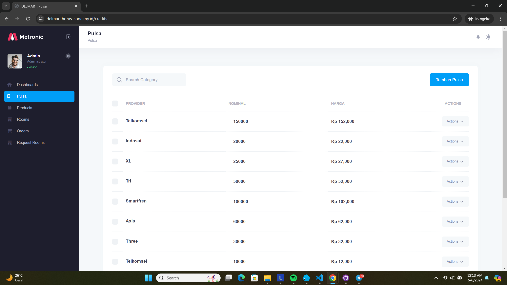
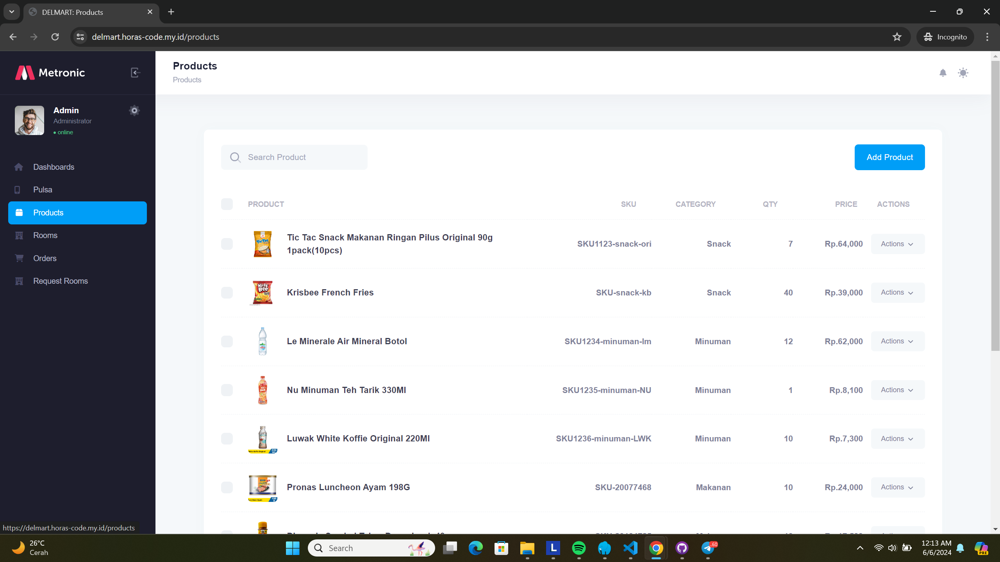
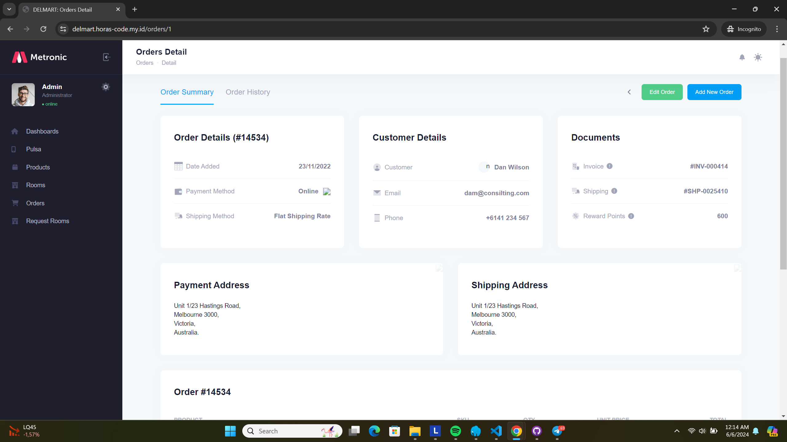

# Delmart Admin and REST API

Delmart is an e-commerce platform for IT Del cooperative. This application has a mobile frontend built using Flutter, which interacts with a backend built using Laravel as a REST API. This document focuses on the Laravel backend, covering both the admin panel and the REST API.

## Table of Contents

- [Features](#features)
- [Screenshots](#screenshots)
- [Installation](#installation)
- [Usage](#usage)
- [API Endpoints](#api-endpoints)
- [Architecture](#architecture)
- [Contributing](#contributing)
- [License](#license)

## Features

- User authentication
  - Login
  - Register
  - Forgot password
  - Reset password
  - Google login
- Credit management
- Product management
- Order management
  - View orders
  - Cancel orders
- User profile management
- Shopping cart management
- Room booking management
  - View rooms
  - Request rooms
  - Cancel room requests
- REST API for mobile app interaction

## Screenshots

Here are some screenshots of the admin panel:





## Installation

### Prerequisites

- PHP 8.0+
- Composer
- MySQL
- Laravel installed

### Steps

1. Clone the repository:

    ```bash
    git clone https://github.com/yourusername/delmart-backend.git
    cd delmart-backend
    ```

2. Set up environment variables:

    ```bash
    cp .env.example .env
    php artisan key:generate
    ```

3. Configure your `.env` file with your database credentials and other necessary configurations.

4. Run migrations and seed the database:

    ```bash
    php artisan migrate --seed
    ```

5. Serve the application:

    ```bash
    php artisan serve
    ```

## Usage

To start the Laravel application, run:

```bash
php artisan serve
```

## API Endpoints

### Authentication

- **POST** `/auth/login` - Authenticate user
- **POST** `/auth/register` - Register a new user
- **POST** `/auth/forgot-password` - Request password reset link
- **POST** `/auth/reset-password` - Reset password
- **POST** `/auth/logout` - Logout user (requires authentication)
- **POST** `/auth/refresh` - Refresh authentication token
- **GET** `/auth/user-profile` - Get authenticated user's profile
- **POST** `/auth/{provider}` - Authenticate using a provider (e.g., Google)

### Products

- **GET** `/products` - List all products (requires authentication)
- **GET** `/products/{id}` - Get a single product (requires authentication)

### Credits

- **GET** `/credits` - List all credits (requires authentication)
- **GET** `/credits/{id}` - Get a single credit (requires authentication)
- **POST** `/credits/checkout` - Checkout credits (requires authentication)

### Rooms

- **GET** `/rooms` - List all rooms (requires authentication)
- **GET** `/rooms/{id}` - Get a single room (requires authentication)

### Cart

- **GET** `/cart` - View cart items (requires authentication)
- **POST** `/cart/store` - Add item to cart (requires authentication)
- **PUT** `/cart/increase/{id}` - Increase item quantity (requires authentication)
- **PUT** `/cart/decrease/{id}` - Decrease item quantity (requires authentication)
- **DELETE** `/cart/delete/{id}` - Remove item from cart (requires authentication)

### Orders

- **GET** `/orders` - List all orders (requires authentication)
- **GET** `/orders/{id}` - Get a single order (requires authentication)
- **PUT** `/orders/cancel/{id}` - Cancel an order (requires authentication)

### Checkout

- **POST** `/checkout` - Place an order (requires authentication)

### Request Rooms

- **GET** `/request-rooms` - List all room requests (requires authentication)
- **GET** `/request-rooms/{id}` - Get a single room request (requires authentication)
- **POST** `/request-rooms/store` - Request a room (requires authentication)
- **PUT** `/request-rooms/cancel/{id}` - Cancel a room request (requires authentication)

## Architecture

This project uses the MVC architecture pattern provided by Laravel.

- **Model**: Represents the data structure
- **View**: Blade templates for the admin panel
- **Controller**: Handles the application logic and interaction between the model and the view

## Live Demo

You can access the live demo of the application at Delmart Live Demo.

## Contributing

Contributions are welcome! Please fork the repository and create a pull request with your changes.

## License

This project is licensed under the MIT License. See the [LICENSE](LICENSE) file for more details.

---
